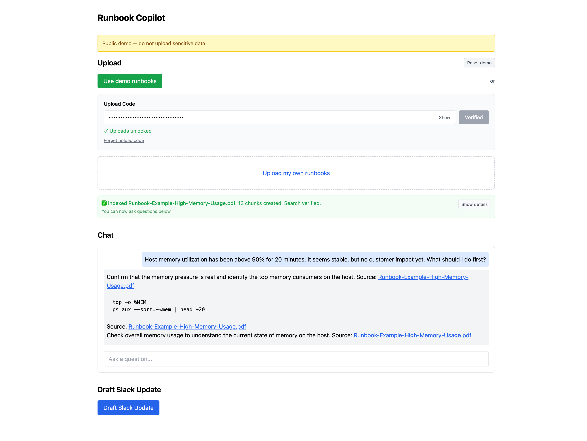
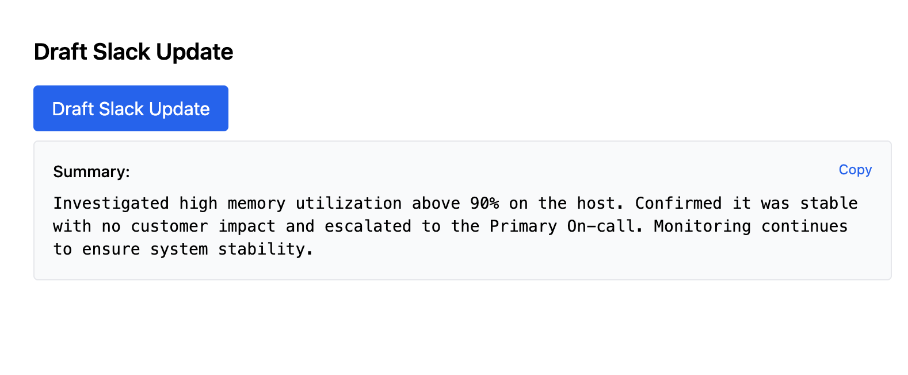
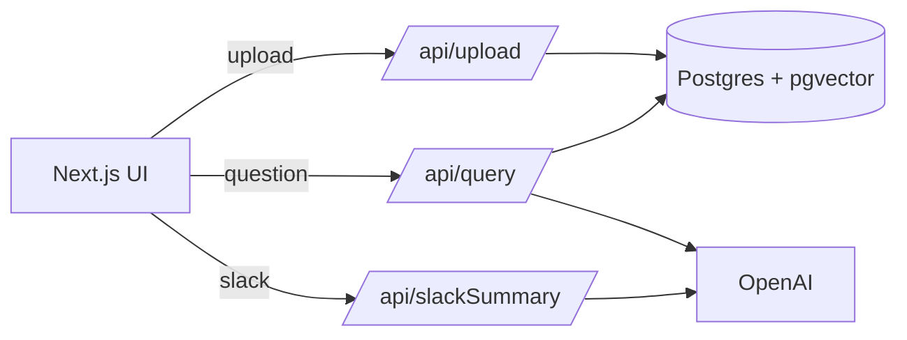

# Runbook Copilot


Agentic RAG runbook copilot: upload runbooks → ask questions → get step-by-step answers with sources → draft Slack updates.

**Run it in 30s**: Upload PDF/Markdown runbooks, ask "How do I mitigate high memory usage?", get cited answers, and draft incident updates.

## Screenshots

<p align="center">
  
  <br>
  <em>Ask questions, get grounded answers with source citations</em>
</p>

| Draft Slack Updates | Hybrid Search Details |
|:-------------------:|:---------------------:|
|  |  |
| *Generate incident updates ready to paste into Slack* | *Hybrid search with cosine similarity and keyword reranking* |

## Features

- **Upload runbooks** (PDF/Markdown) → automatically extracted, chunked, and embedded
- **Ask questions** → AI agent searches your runbooks and answers with citations
- **Draft Slack updates** → generate concise incident updates from the same context
- **Public demo mode** → rate-limited, upload-gated for safe public demos

## Architecture



**Tech stack:**
- **Next.js App Router** - Server-side API routes and client components
- **Postgres + pgvector** - Vector similarity search for retrieval
- **LlamaIndex.TS** - Agent/tool calling for RAG orchestration
- **Vercel serverless** - Edge-optimized deployment

## Setup

### 1) Database (Postgres + pgvector)

Use any Postgres database with pgvector support (e.g., [Neon](https://neon.tech), Vercel Postgres, Supabase).

1. Create a Postgres database with pgvector extension.
2. Apply the schema:
   ```bash
   psql "$DATABASE_URL" -f lib/schema.sql
   ```
   
   The schema enables:
   - `vector` extension (for embeddings)
   - `pgcrypto` extension (for `gen_random_uuid()`)

### 2) Environment Variables

Create `.env.local` (or set in Vercel):

**Required:**
- `DATABASE_URL` = Postgres connection string (e.g., from Neon, Vercel Postgres, Supabase)
- `OPENAI_API_KEY` = OpenAI API key

**Demo / safety:**
- `PUBLIC_DEMO` = `true` (recommended for public demos; gates uploads and shows warning banner)
- `UPLOAD_TOKEN` = random token (e.g., `openssl rand -hex 16`) used to unlock uploads via header `x-upload-token`

**Optional:**
- `BLOB_READ_WRITE_TOKEN` = Vercel Blob token for optional file storage (uploads work via multipart/form-data even without it)
- `OPENAI_MODEL` = `gpt-4o-mini` (default if not set)
- `OPENAI_EMBEDDING_MODEL` = `text-embedding-3-small` (default if not set)
- `ENABLE_VERIFY_SEARCH` = `true` (enables upload preview scoring cards; default: false, skipped in production for speed)
- `NEXT_PUBLIC_DEBUG_UPLOADS` = `true` (enables verbose console logging; default: false)

### 3) Local Dev

```bash
npm install
npm run dev
```

### 4) Vercel Deploy

1. Import the GitHub repo as a Vercel Project (auto-deploy on push).
2. Set env vars in Vercel (Production + Preview as needed).
3. Deploy.

### 5) Public Demo Mode Behavior (`PUBLIC_DEMO=true`)

**Public endpoints (rate-limited):**
- `/api/query` - Ask questions about your runbooks
- `/api/slackSummary` - Generate Slack incident updates
- `/api/seedDemo` - Load demo runbooks (idempotent)

**Gated endpoint:**
- `/api/upload` - Requires `UPLOAD_TOKEN` (header: `x-upload-token`)

**UI behavior:**
- Shows a "Public demo — do not upload sensitive data." banner
- Upload UI is locked until a valid upload code is verified via `/api/upload/verify`
- Upload code can be entered in the UI and verified server-side

### 6) Security / Demo Warning

**⚠️ Do not upload sensitive data.** This is a demo application with rate limiting but no authentication system.

- `PUBLIC_DEMO=true` gates uploads behind `UPLOAD_TOKEN` and shows a warning banner
- Rate limiting applies to all public endpoints (`/api/query`, `/api/slackSummary`, `/api/seedDemo`)
- "Reset demo" button clears local storage state (upload tokens, verification flags)
- Upload code verification is server-side only; tokens are never exposed to the client

### 7) Quick Demo Script

1. **Load demo runbooks**: Click "Use demo runbooks" (or call `POST /api/seedDemo`)
2. **Ask a question**: Type a question like "How do I mitigate high memory usage?" in the chat
3. **Draft Slack update**: After getting an answer, click "Draft Slack Update" to generate an incident update
4. **Optional - Upload your own**: If you have an upload code, enter it to unlock uploads and upload your own PDF/Markdown runbooks

## Troubleshooting

- **If upload times out**: Check Vercel logs for `request_id` and stage timings to identify which stage is slow.
- **If uploads appear "unlocked" unexpectedly**: Clear site localStorage keys:
  - `rbc_upload_token`
  - `rbc_upload_verified`
- **For detailed deployment instructions**: See `DEPLOYMENT.md`

